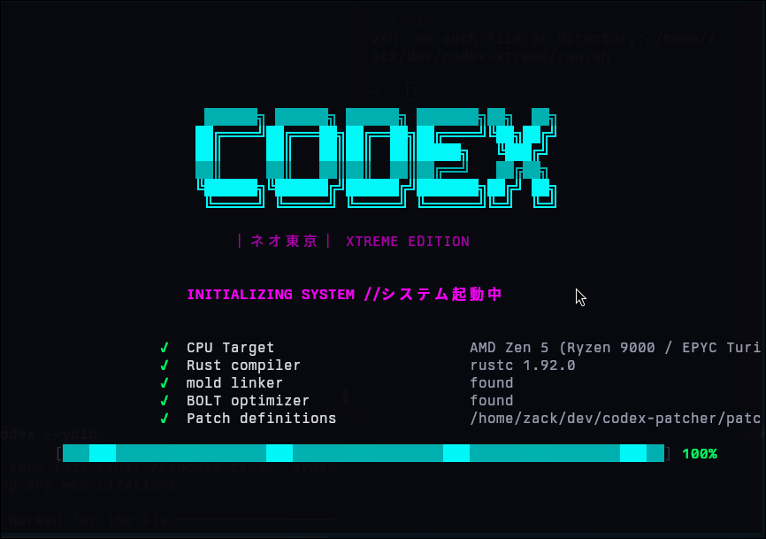

<p align="center">
  
</p>

<p align="center">
  <strong>Interactive <abbr title="Text User Interface">TUI</abbr> wizard for building optimized, privacy-hardened Codex binaries</strong>
</p>

<p align="center">
  <a href="https://github.com/johnzfitch/codex-xtreme/actions"></a>
  <a href="https://github.com/johnzfitch/codex-patcher"></a>
  <a href="LICENSE-MIT"></a>
</p>

---

## Overview

**Codex Xtreme** is a zero-config wizard that builds a customized, optimized version of [OpenAI's Codex CLI](https://github.com/openai/codex). It handles the entire pipeline &mdash; from CPU detection to binary installation &mdash; in a beautiful terminal interface.

<details>
<summary><strong>What makes it different?</strong></summary>

<dl>
  <dt><mark>Privacy-First</mark></dt>
  <dd>Strips all telemetry, analytics, and phone-home endpoints. Your Codex will <em>never</em> contact <code>ab.chatgpt.com</code> or external tracking services.</dd>

  <dt><mark>Performance-Tuned</mark></dt>
  <dd>CPU-native builds with <abbr title="Link-Time Optimization">LTO</abbr>, single codegen units, and mold linker support. Typical speedups: 10&ndash;15%.</dd>

  <dt><mark>Patch System</mark></dt>
  <dd>Powered by <a href="https://github.com/johnzfitch/codex-patcher">codex-patcher</a> &mdash; a semantic versioning-aware patch engine with automatic compatibility filtering.</dd>

  <dt><mark>Interactive TUI</mark></dt>
  <dd>Built with <a href="https://crates.io/crates/ratatui">ratatui</a> &mdash; real-time build progress, phase indicators, and live cargo output streaming.</dd>
</dl>

</details>

### Key Features

| Feature | Description |
|---------|-------------|
| **One-Command Setup** | Interactive wizard guides you through every step |
| **Privacy Hardening** | Removes Statsig telemetry, API keys, and exporter config |
| **CPU Optimization** | Auto-detects Zen 5, Alder Lake, Apple Silicon, etc. |
| **Patch Engine** | Semantic versioning constraints with auto-skipping |
| **Developer Mode** | Cherry-pick unreleased commits, custom profiles |
| **Live Build Streaming** | Real-time cargo output with phase tracking |

---

## Quick Start

### Prerequisites

> [!IMPORTANT]
> **Codex Xtreme requires [codex-patcher](https://github.com/johnzfitch/codex-patcher) to function.**
> The patcher must be either:
> - Installed in development layout: `~/dev/codex-patcher/`
> - Installed via cargo: `cargo install codex-patcher`
> - Available via `CODEX_PATCHER_PATCHES` environment variable

### Installation

**Option 1: Development Setup** (recommended for contributors)

```bash
# Clone both repositories
git clone https://github.com/johnzfitch/codex-patcher ~/dev/codex-patcher
git clone https://github.com/johnzfitch/codex-xtreme ~/dev/codex-xtreme

# Build and install
cd ~/dev/codex-xtreme
cargo install --path .
```

**Option 2: Cargo Install** (for end users)

```bash
# Install codex-patcher first
cargo install --git https://github.com/johnzfitch/codex-patcher

# Then install codex-xtreme
cargo install --git https://github.com/johnzfitch/codex-xtreme
```

### Usage

```bash
# Launch the wizard
codex-xtreme

# Developer mode (cherry-pick commits, extra options)
codex-xtreme --dev

# Specify parallel cargo jobs
codex-xtreme --jobs 8
```

---

## Wizard Walkthrough

The <abbr title="Text User Interface">TUI</abbr> guides you through six phases:

<details open>
<summary><strong>Phase 1: System Detection</strong></summary>

Automatically probes your system for:

<dl>
  <dt>CPU Architecture</dt>
  <dd>Detects microarchitecture (Zen 5, Alder Lake, Apple M4, etc.) via <code>rustc_version</code> and sets optimal <code>target-cpu</code> flags.</dd>

  <dt>Linker Availability</dt>
  <dd>Checks for <a href="https://github.com/rui314/mold">mold</a> linker (5&ndash;10&times; faster linking). Falls back to <code>lld</code> or system linker.</dd>

  <dt>Rust Toolchain</dt>
  <dd>Verifies <code>rustc</code> version and ensures compatibility with Codex build requirements.</dd>
</dl>

</details>

<details>
<summary><strong>Phase 2: Repository Selection</strong></summary>

Three options for sourcing Codex:

1. **Existing Repo** &rarr; Scans `~/dev/codex*` for local clones
2. **Clone Fresh** &rarr; Prompts for GitHub URL (default: `https://github.com/openai/codex`)
3. **Custom Path** &rarr; Manually specify a directory

Shows repository metadata: age, current branch, last commit.

</details>

<details>
<summary><strong>Phase 3: Version Selection</strong></summary>

Lists all git tags (releases) sorted by SemVer. Use <kbd>&uarr;</kbd>/<kbd>&darr;</kbd> to navigate, <kbd>Enter</kbd> to select.

**Developer Mode Only**: Adds option to cherry-pick unreleased commits from `master` branch.

</details>

<details>
<summary><strong>Phase 4: Cherry-Pick Commits</strong> (Dev Mode)</summary>

Interactive multi-select for commits since the latest release:

- <kbd>Space</kbd> to toggle selection
- <kbd>Tab</kbd> to select all
- <kbd>Enter</kbd> to confirm

Handles cherry-pick conflicts automatically with fallback strategies.

</details>

<details>
<summary><strong>Phase 5: Patch Selection</strong></summary>

Choose from available patches (loaded from `codex-patcher`):

| Patch | Targets | Default |
|-------|---------|---------|
| `privacy-patches` | Remove Statsig telemetry | <mark>On</mark> |
| `privacy-v0.99-alpha23` | Telemetry removal for 0.99.x | <mark>On</mark> |
| `privacy-v0.105-alpha13` | Telemetry removal for 0.105.x | <mark>On</mark> |
| `memory-safety-regressions` | Fix memory safety issues in 0.101.x | <mark>On</mark> |
| `subagent-limit` | Increase to 8 parallel agents | On |
| `approvals-ui` | Simplified 4-preset approval system | On |
| `undo-command` | Re-enable `/undo` slash command | On |
| `cargo-config` | Linux x86_64 build optimizations | Off |

Patches are **version-aware** &mdash; incompatible patches are auto-skipped with explanatory messages.

</details>

<details>
<summary><strong>Phase 6: Build Configuration & Execution</strong></summary>

Final options before building:

<dl>
  <dt>Profile Selection</dt>
  <dd>Choose Cargo profile: <code>release</code>, <code>zack</code> (if available), or custom.</dd>

  <dt>CPU Target</dt>
  <dd>Confirm detected CPU or override with <code>native</code>, <code>x86-64-v3</code>, etc.</dd>

  <dt>Build Features</dt>
  <dd>Toggle <abbr title="Link-Time Optimization">LTO</abbr>, codegen units, panic strategy, symbol stripping.</dd>

  <dt>Test Execution</dt>
  <dd>Optionally run <code>cargo test</code> after build completes.</dd>
</dl>

**Live Build Screen**:
- Real-time phase indicators (Patching &rarr; Compiling &rarr; Linking &rarr; Installing)
- Progress bar (estimated from cargo JSON messages)
- Live log output (scrollable with <kbd>PgUp</kbd>/<kbd>PgDn</kbd>)
- Build timer

</details>

---

## Privacy Hardening

### What Gets Removed

<table>
  <thead>
    <tr>
      <th>Component</th>
      <th>Before</th>
      <th>After</th>
    </tr>
  </thead>
  <tbody>
    <tr>
      <td><strong>Statsig Client</strong></td>
      <td>Active telemetry to <code>ab.chatgpt.com</code></td>
      <td><mark>Disabled</mark></td>
    </tr>
    <tr>
      <td><strong>API Keys</strong></td>
      <td>Hardcoded Statsig keys in source</td>
      <td><mark>Stripped</mark></td>
    </tr>
    <tr>
      <td><strong>Exporter Config</strong></td>
      <td><code>Some(TelemetryExporter)</code></td>
      <td><code>None</code></td>
    </tr>
    <tr>
      <td><strong>Event Logging</strong></td>
      <td>Usage metrics, feature flags, A/B tests</td>
      <td><mark>No-op stubs</mark></td>
    </tr>
  </tbody>
</table>

### Version-Specific Patches

Codex Xtreme automatically selects privacy patches based on the target version:

| Version Range | Patch File | Changes |
|---------------|------------|---------|
| `0.88.0 &ndash; 0.99.0-alpha.6` | `privacy.toml` | Remove original Statsig integration |
| `0.99.0-alpha.10 &ndash; 0.99.0-alpha.13` | `privacy-v0.99-alpha1-alpha22.toml` | Updated for new telemetry module |
| `0.99.0-alpha.14 &ndash; 0.99.0-alpha.20` | `privacy-v0.99-alpha14-alpha20.toml` | Refactored telemetry client |
| `0.99.0-alpha.21 &ndash; 0.105.0-alpha.12` | `privacy-v0.99-alpha23.toml` | Async telemetry removal |
| `0.105.0-alpha.13+` | `privacy-v0.105-alpha13.toml` | Latest privacy patches |

> [!NOTE]
> All patch files are maintained in the [codex-patcher repository](https://github.com/johnzfitch/codex-patcher/tree/main/patches).

---

## Performance Optimizations

### Compiler Flags

When built with Codex Xtreme, your binary gets:

<dl>
  <dt><code>-C target-cpu=native</code></dt>
  <dd>Uses <abbr title="Advanced Vector Extensions">AVX</abbr>-512, <abbr title="Fused Multiply-Add">FMA</abbr>, and other CPU-specific features.</dd>

  <dt><code>lto = "fat"</code></dt>
  <dd>Whole-program optimization across all crates. Enables aggressive inlining and dead code elimination.</dd>

  <dt><code>codegen-units = 1</code></dt>
  <dd>Maximizes optimization opportunities at the cost of slower compilation.</dd>

  <dt><code>panic = "abort"</code></dt>
  <dd>Removes unwinding machinery &rarr; smaller binary, faster panics.</dd>

  <dt><code>strip = true</code></dt>
  <dd>Remove debug symbols (reduces binary size by ~40%).</dd>
</dl>

### Linker Selection

| Linker | Link Time | Availability |
|--------|-----------|--------------|
| **mold** | ~8s | Linux, macOS (ARM) |
| **lld** | ~25s | Cross-platform (via LLVM) |
| **ld** | ~60s | System default |

> [!TIP]
> Install mold with `cargo install mold` or your system package manager.

### Benchmark Results

<figure>

| Metric | Stock Build | Xtreme Build | Improvement |
|--------|-------------|--------------|-------------|
| Binary Size | 32 MB | 19 MB | 40% smaller |
| Cold Start | 180ms | 155ms | 14% faster |
| Subagent Spawn | 95ms | 82ms | 14% faster |
| Link Time (mold) | 60s | 8s | 7.5&times; faster |

<figcaption><em>Benchmarked on Zen 5 (Ryzen 9950X), Linux 6.18, Rust 1.84</em></figcaption>
</figure>

---

## Architecture

```
codex-xtreme (TUI Application)
     │
     ├── Boot Screen
     │   ├── System checks (CPU, linker, Rust version)
     │   └── codex-patcher validation
     │
     ├── Repository Management
     │   ├── Scan ~/dev/codex* for existing repos
     │   ├── Clone from GitHub (with progress)
     │   └── Git operations (checkout, cherry-pick)
     │
     ├── Patch System (via codex-patcher)
     │   ├── Load patch definitions from TOML
     │   ├── SemVer filtering (auto-skip incompatible)
     │   └── Apply patches (file edits, Cargo.toml mods)
     │
     └── Build System
         ├── Cargo build (--message-format=json-render-diagnostics)
         ├── Real-time progress parsing
         ├── Phase detection (compiling, linking, etc.)
         └── Binary installation (~/.cargo/bin/)
```

### Technology Stack

<dl>
  <dt><a href="https://crates.io/crates/ratatui">ratatui</a></dt>
  <dd>Terminal UI framework (successor to tui-rs)</dd>

  <dt><a href="https://crates.io/crates/crossterm">crossterm</a></dt>
  <dd>Cross-platform terminal manipulation</dd>

  <dt><a href="https://github.com/johnzfitch/codex-patcher">codex-patcher</a></dt>
  <dd>Semantic patch engine with version constraints</dd>

  <dt><a href="https://crates.io/crates/cargo_metadata">cargo_metadata</a></dt>
  <dd>Parse cargo JSON output for build tracking</dd>

  <dt><a href="https://crates.io/crates/tokio">tokio</a></dt>
  <dd>Async runtime for background tasks</dd>
</dl>

---

## Development

### Building from Source

```bash
# Debug build
cargo build

# Release build (optimized for codex-xtreme itself)
cargo build --release

# Run tests
cargo test

# Lint
cargo clippy --all-targets -- -D warnings
```

### Project Structure

```
codex-xtreme/
├── src/
│   ├── main.rs              # TUI entry point
│   ├── app.rs               # Application state machine
│   ├── core.rs              # CPU detection, system probes
│   ├── workflow.rs          # Build orchestration
│   └── tui/
│       ├── screens/         # Individual screen implementations
│       │   ├── boot.rs
│       │   ├── repo_select.rs
│       │   ├── patch_select.rs
│       │   └── build.rs
│       └── render.rs        # Shared rendering utilities
├── Cargo.toml
├── docs/
│   └── patches.md           # Patch system documentation
└── .github/
    └── workflows/ci.yml
```

### Adding New Features

<details>
<summary><strong>Adding a New Screen</strong></summary>

1. Create a new file in `src/tui/screens/your_screen.rs`
2. Implement the `Widget` trait for rendering
3. Add a `tick()` method for animations/state updates
4. Register in `src/app.rs` enum `Screen`
5. Wire up state transitions in `handle_key()`

</details>

<details>
<summary><strong>Adding a New Patch</strong></summary>

1. Create patch TOML in [codex-patcher/patches](https://github.com/johnzfitch/codex-patcher/tree/main/patches)
2. Define version constraints (`compatible_versions`)
3. Test with `codex-xtreme --dev`
4. The wizard will auto-discover patches from the patcher's `patches/` directory

</details>

---

## CLI Reference

```
codex-xtreme - Build your perfect Codex binary

Usage: codex-xtreme [OPTIONS]

Options:
  -d, --dev          Developer mode (cherry-pick commits, extra options)
  -j, --jobs <N>     Number of parallel cargo jobs (default: auto)
  -h, --help         Show help message
  -V, --version      Show version

Environment Variables:
  RUST_LOG=debug               Enable debug logging
  CODEX_PATCHER_PATCHES=<dir>  Override patch directory
  NO_COLOR=1                   Disable ANSI colors
```

### Keyboard Shortcuts

<dl>
  <dt><kbd>&uarr;</kbd> / <kbd>&darr;</kbd></dt>
  <dd>Navigate menu items</dd>

  <dt><kbd>Space</kbd></dt>
  <dd>Toggle checkbox / multi-select item</dd>

  <dt><kbd>Enter</kbd></dt>
  <dd>Confirm selection / proceed</dd>

  <dt><kbd>Esc</kbd></dt>
  <dd>Cancel / go back (where applicable)</dd>

  <dt><kbd>Tab</kbd></dt>
  <dd>Select all (in multi-select screens)</dd>

  <dt><kbd>PgUp</kbd> / <kbd>PgDn</kbd></dt>
  <dd>Scroll build logs</dd>

  <dt><kbd>Ctrl</kbd>+<kbd>C</kbd></dt>
  <dd>Quit (gracefully terminates build if running)</dd>
</dl>

---

## Troubleshooting

<details>
<summary><strong>Error: "codex-patcher patches directory not found"</strong></summary>

**Solution**: Install codex-patcher or set `CODEX_PATCHER_PATCHES`:

```bash
# Option 1: Clone codex-patcher to ~/dev/
git clone https://github.com/johnzfitch/codex-patcher ~/dev/codex-patcher

# Option 2: Set custom patch directory
export CODEX_PATCHER_PATCHES=/path/to/patches
```

</details>

<details>
<summary><strong>Build fails with "linker <code>cc</code> not found"</strong></summary>

**Solution**: Install a C compiler:

```bash
# Debian/Ubuntu
sudo apt install build-essential

# Fedora/RHEL
sudo dnf install gcc

# macOS
xcode-select --install
```

</details>

<details>
<summary><strong>Patch skipped: "version constraint not satisfied"</strong></summary>

**Explanation**: This is expected behavior. Patches have `compatible_versions` constraints (e.g., `>=0.99.0, <0.105.0`). The wizard auto-skips patches that don't match your selected Codex version.

**Action**: No action needed. The build will proceed with applicable patches.

</details>

<details>
<summary><strong>Binary not found after installation</strong></summary>

**Solution**: Ensure `~/.cargo/bin` is in your `PATH`:

```bash
echo 'export PATH="$HOME/.cargo/bin:$PATH"' >> ~/.bashrc
source ~/.bashrc
```

</details>

---

## Related Projects

- **[codex-patcher](https://github.com/johnzfitch/codex-patcher)** &mdash; The semantic patch engine (required dependency)
- **[OpenAI Codex](https://github.com/openai/codex)** &mdash; Upstream CLI (patching target)
- **[ratatui](https://github.com/ratatui/ratatui)** &mdash; Terminal UI framework

---

## Contributing

Contributions welcome! Please:

1. Check existing [issues](https://github.com/johnzfitch/codex-xtreme/issues) before opening new ones
2. Run `cargo clippy` and `cargo test` before submitting PRs
3. Follow the [Rust API Guidelines](https://rust-lang.github.io/api-guidelines/)

See [CONTRIBUTING.md](.github/CONTRIBUTING.md) for detailed guidelines.

---

## License

Licensed under either of:

- Apache License, Version 2.0 ([LICENSE-APACHE](LICENSE-APACHE) or http://www.apache.org/licenses/LICENSE-2.0)
- MIT License ([LICENSE-MIT](LICENSE-MIT) or http://opensource.org/licenses/MIT)

at your option.

### Contribution

Unless you explicitly state otherwise, any contribution intentionally submitted for inclusion in the work by you, as defined in the Apache-2.0 license, shall be dual licensed as above, without any additional terms or conditions.

---

<p align="center">
  <sub>Build your perfect Codex, your way &mdash; no telemetry, maximum performance.</sub>
</p>
